# Technology Web — Integration Map

**Scope:** the cross-domain view of the tech web. The eight domain catalogs (physics-energy-spaceflight, planetary-megastructures, infrastructure-materials, computing-communications, biology-medicine, society-governance, economics-markets, military-espionage) each design their own interior; this document maps how they feed each other, which combinations pay off, and which civilizational identities emerge when a player commits to a cross-domain route. Emergent (`emg_*`) techs from systems.md are excluded — they are triggered by conduct, not researched, and do not participate in the prerequisite graph.

---

## 1. Topology Overview

The web has **three roots** — techs with no prerequisites at all:

- `phys_fusion_power` (energy),
- `mat_advanced_composites` (matter),
- `plan_closed_ecologies` (life support).

Everything else descends from one of these, and the descent runs along **two trunks**:

**The energy–compute trunk:** `phys_fusion_power → infra_planetary_grid → comp_distributed_compute`. Compute is the universal Tier 1→2 multiplier: it gates `soc_digital_governance` (and through it the entire society domain plus mass media and development finance), `bio_genomic_medicine` (and through it all advanced biology), `plan_climate_control`, `infra_automated_ports`, `econ_automated_markets`, and — combined with composites — `comp_machine_intelligence`, which is in turn the single gate for every Tier 3+ automation payoff in the game (`mat_molecular_manufacturing`, `infra_autonomous_factories`, `mil_autonomous_warfare`, `comp_synthetic_minds`, `comm_memetic_engineering`, `mega_dyson_swarm`).

**The matter–interstellar trunk:** `mat_advanced_composites → space_orbital_logistics → comm_deep_space_network`. The relay network is the most load-bearing single anchor in the web: `econ_interstellar_banking`, `esp_sigint`, `mil_command_networks`, `soc_provincial_charters`, `space_deep_navigation`, `comm_quantum_secure`, and both Tier 2 network-order doctrines all hang directly off it. A faction that delays composites delays its entire interstellar layer — banking, intelligence, and command alike.

`plan_closed_ecologies` roots the third, quieter lineage — habitats. It feeds `plan_climate_control`, `bio_ecoforming`, `mat_industrial_arcologies`, and (with orbital logistics) `mega_orbital_habitats`, which is itself the anchor that megastructures, nomad play, habitat governance, and substrate emigration all require.

**Notable cross-domain feed patterns:**

- **Espionage feeds Computing:** `esp_sigint` is a prerequisite of `comp_predictive_systems`, so every forecasting-derived tech in the game — futures markets, predictive governance, tectonic engineering, predictive intel — transits the espionage domain. Societal forecasting is institutionalized signals intelligence; the web makes that lineage literal.
- **Society feeds Computing's endgame:** `soc_digital_governance` gates `comp_autonomous_administration`; `soc_federal_autonomy` and `soc_surveillance_state` split the Tier 4 machine-sovereignty fork (`comp_machine_polity` vs `comp_oracle_state`). What kind of state you built decides what kind of machine gets to inherit it.
- **Biology and Computing converge twice:** `comp_machine_intelligence + bio_gene_engineering → comp_synthetic_minds`, and later `comp_synthetic_minds + bio_longevity + mega_orbital_habitats → comp_substrate_migration`. The mind-uploading endgame requires mastering wetware, hardware, and habitat simultaneously.
- **Economics is a lattice, not a ladder:** almost every economy tech past Tier 1 requires a non-economy partner (compute for algorithmic markets, forecasting for futures, governance for dev finance, quantum channels for clearing, infowar for market warfare). The economy domain cannot be rushed in isolation; it monetizes what the rest of the web builds.
- **Physics reappears at every tier as a gate:** fusion at Tier 1, directed energy at Tier 2 (feeding comms security, metamaterials, spectral warfare, magnetospheres), antimatter at Tier 3 (feeding deterrence, lane forging, singularity engines, planetary disassembly). Physics is never a destination; it is always the toll bridge.

**Mutex forks** partition identity at Tier 2 (power doctrine, settlement doctrine, industrial organization, network order, statecraft, capital doctrine, force identity, enhancement path) and destiny at Tier 4 (stellar destiny, world's purpose, machine sovereignty, sovereignty, market endstate, species destiny, command sovereignty, fabrication endstate). The civilization paths in §4 note which forks they consume.

---

## 2. Combination Unlocks

Cross-domain combinations with a real payoff tech in the current catalogs. All ids are canonical. Rows marked **(bridge)** point at new techs defined in §3.

| Tech A (domain) | Tech B (domain) | Unlocks | What the combination buys |
|---|---|---|---|
| `phys_fusion_power` (physics) | `mat_advanced_composites` (materials) | `phys_directed_energy` | Beam weapons and power beaming: energy abundance shaped by materials that can survive the emitter. |
| `plan_closed_ecologies` (planetary) | `space_orbital_logistics` (spaceflight) | `mega_orbital_habitats` | Sealed ecologies plus cheap lift = permanent population in orbit; the habitat era begins. |
| `comp_distributed_compute` (computing) | `esp_sigint` (espionage) | `comp_predictive_systems` | Planetary compute pointed at intercepted society-scale data: the forecasting state. |
| `comm_deep_space_network` (comms) | `phys_directed_energy` (physics) | `comm_quantum_secure` | Relay coverage plus coherent optics = tamper-evident channels; the encryption-upgrade counterplay tag. |
| `esp_sigint` (espionage) | `econ_interstellar_banking` (economics) | `esp_resident_networks` | Intelligence residencies funded and covered by legitimate financial infrastructure. |
| `mat_orbital_industry` (materials) | `comp_machine_intelligence` (computing) | `mat_molecular_manufacturing` | Microgravity fabs run by machine minds: the nanoforge and the conversion matrix. |
| `comp_machine_intelligence` (computing) | `bio_gene_engineering` (biology) | `comp_synthetic_minds` | Machine cognition informed by engineered neurobiology: synthetic leaders and the personhood crisis. |
| `mega_orbital_habitats` (megastructures) | `space_advanced_drives` (spaceflight) | `mega_nomad_flotillas` | Bolt torch drives to a habitat and the city stops orbiting anything: the flotilla entity class. |
| `bio_gene_engineering` (biology) | `soc_digital_governance` (society) | `bio_germline_charter` | Genetic policy administered through the civic platform: enhancement as universal public provision. |
| `econ_dev_finance` (economics) | `esp_predictive_intel` (espionage) | `econ_debt_leverage` | Lending guided by intelligence on the borrower: the loan-call as a weapon. |
| `comp_predictive_systems` + `comm_mass_media` (computing/comms) | `mil_command_networks` (military) | `comm_infowar_suite` | Forecasting, broadcast reach, and command discipline fused into one information-warfare tasking order. |
| `phys_antimatter` + `space_deep_navigation` (physics/spaceflight) | `mil_orbital_strike` (military) | `mil_antimatter_deterrence` | Warheads, off-graph patrol platforms, and strike doctrine: the deterrence architecture. |
| `bio_synthetic_biology` (biology) | `esp_synthetic_identities` (espionage) | `bio_tailored_pathogens` | Designed organisms delivered by fabricated people: deniable biological warfare. |
| `mat_molecular_manufacturing` (materials) | `soc_digital_governance` (society) | `mat_fabrication_commons` | Nanoforges governed as a commons: the post-scarcity flag and everything it breaks. |
| `mega_orbital_habitats` (megastructures) | `soc_provincial_charters` (society) | `soc_habitat_charters` | Habitats as chartered micro-polities: population transfer, rent, and cohesion at station scale. |
| `plan_climate_control` + `bio_enviro_adaptation` (planetary/biology) | `phys_fusion_power` (physics) | `plan_terraforming` | Climate machinery, adapted pioneer populations, and the energy budget to move an atmosphere. |
| `plan_subterranean_engineering` (planetary) | `mil_command_networks` (military) | `mil_fortress_doctrine` **(bridge)** | Undercities turned into command-integrated deep fortresses. |
| `phys_grid_storage` (physics) | `econ_commodity_exchanges` (economics) | `econ_energy_arbitrage` **(bridge)** | Banked energy listed as a spot commodity: the power bourse. |
| `bio_genomic_medicine` (biology) | `soc_actuarial_state` (society) | `soc_vital_register` **(bridge)** | Population genomics underwriting the insurance state. |
| `infra_mass_driver` (infrastructure) | `mil_orbital_strike` (military) | `mil_kinetic_interdiction` **(bridge)** | Surface mass drivers integrated into strike doctrine: ground-based orbit denial. |
| `bio_synthetic_biology` + `mat_orbital_industry` (biology/materials) | `space_advanced_drives` (spaceflight) | `bio_living_hulls` **(bridge)** | Grown ship hulls: self-repairing fleets from the living-structures line. |
| `soc_continuity_protocols` (society) | `mega_nomad_flotillas` (megastructures) | `soc_wandering_throne` **(bridge)** | Continuity-of-government doctrine fused with the mobile capital: sovereignty that cannot be besieged. |

---

## 3. Bridge Technologies

Six new techs added by integration where a compelling cross-domain combination had no payoff in any catalog. Each gives an existing leaf tech (`plan_subterranean_engineering`, `phys_grid_storage`, `infra_mass_driver`, `soc_continuity_protocols`) or an under-connected pair a downstream reason to exist. Domain owners should feel free to adopt these into their files; ids are final.

### Deep Redoubt Doctrine (`mil_fortress_doctrine`)
- **Domain:** military | **Tier:** 2
- **Prerequisites:** plan_subterranean_engineering, mil_command_networks
- **Concept:** The undercity re-read as a weapon: excavated slot layers hardened into command-integrated deep fortresses, on the logic of Cheyenne Mountain and the Maginot lesson — depth works when it is wired into a living command net, and fails when it substitutes for one.
- **What becomes possible:** A world that keeps fighting after losing its sky. Occupation of a redoubt world becomes a campaign, not a formality.
- **Gameplay mechanic unlocked:** Designate excavated undercity slots as **redoubt complexes**: garrisons stationed there survive orbital bombardment at a steep mitigation multiplier, ground combat against the redoubt runs at defender-favored terrain modifiers, and — against the **siege lockout** this doctrine's engine work introduces — the planet keeps issuing planetary and construction orders while the redoubt holds. Every other besieged world in the game goes administratively dark; a redoubt world does not.
- **Engine hook:** Order `MIL_DESIGNATE_REDOUBT { planetId, undercitySlotId }` in the scripts/game-loop.ts switch; stacks with the existing bombardment mitigation in `MIL_BOMBARD_PLANET`; building `redoubt_complex` (undercity layer only, `techRequired: 'mil_fortress_doctrine'`). The "keeps issuing orders" clause is an exemption from a lockout that **does not exist yet and must be built as part of this tech**. Today orbital suppression is purely an attacker-side concept: `isOrbitSuppressed` / `orbitControlLost` (lib/orbital/orbital-service.ts:191, 357-424) gate only the attacker's invasion landing (scripts/game-loop.ts:975-977), decorate bombardment logging (~line 1308), and feed blockade evaluation (lib/logistics/blockade-service.ts:147-152) — a planet under enemy orbit control issues and executes its own orders normally. The new work is a pre-dispatch check in exactly the place systems.md Phase 1 puts `ORDER_TECH_GATES` (once at the top of the game-loop order switch, failing via `recordOrderFailure`): `PLANET_*` and construction orders targeting a planet whose orbit is suppressed by a hostile fleet are rejected, and a `redoubtIntact` flag on the planet — set by `MIL_DESIGNATE_REDOUBT`, cleared when the complex is reduced — exempts it. Without that check the doctrine's headline is inert, and orbit control never costs a defender anything.
- **Required capacity:** An excavated undercity (PLANET_EXCAVATE_UNDERCITY completed), the redoubt complex built per world, and a garrison actually stationed in it. Doctrine without excavation protects nothing.
- **Interactions:** Anti-synergy with `mil_orbital_strike` precision payloads (targetDistrictId strikes cannot reach the undercity layer — attackers must invade); synergy with `plan_hermetic_doctrine` arcology spines and terrain morale modifiers; siege press coverage runs long, feeding war-fatigue mechanics on the attacker.
- **Strategic advantages:** The defender's answer to bombardment doctrine; converts core worlds into attrition sinks; keeps a capital's order queue alive through a siege.
- **Vulnerabilities & consequences:** Redoubts are immobile investments that do nothing for expansion; a world that falls anyway hands the intact complex to the conqueror; and a seceding region with a redoubt is a nightmare to retake — the fortress does not check whose flag flies over it.
- **Emergent follow-ons:** Long-siege press epics; secessionist redoubt crises; attacker doctrine shifting toward blockade-and-starve rather than strike.

### The Power Bourse (`econ_energy_arbitrage`)
- **Domain:** economics | **Tier:** 2
- **Prerequisites:** phys_grid_storage, econ_commodity_exchanges
- **Concept:** Once energy can be banked at grid scale, it can be priced, listed, and shipped like any commodity — and whoever runs the storage runs the spread. The electricity-market lesson, interstellar: storage plus an exchange equals arbitrage.
- **What becomes possible:** Energy stops being a per-planet production stat and becomes a tradeable, weaponizable flow.
- **Gameplay mechanic unlocked:** List banked energy (`energyReserve`) on commodity exchanges as a spot good; **charge-and-ship**: storage banks fill during local surplus and settle sales during rival shortages at spread prices. Factions can corner regional energy markets ahead of a war and sell dark to belligerents.
- **Engine hook:** Extends `ECON_SPOT_TRADE` with resource class `energy_banked`, drawing down `energyReserve` on `PlanetProduction`; settlement rides the existing exchange fee stream; a shortage-price pass in the markets tick reads blackout events from the tick processor as demand spikes.
- **Required capacity:** Storage banks (`storage_bank`) with real charged reserve, exchange membership, and trade-fleet or mass-driver lift to move the storage media. Reserve sold is reserve you no longer have when your own grid browns out.
- **Interactions:** Couples the physics blackout/`GRID_DISCHARGE` machinery to the economy tick; synergy with `phys_gigascale_power`'s `energy_surplus_export` modifier; makes `GRID_CURTAIL` decisions market-visible; energy embargoes become a sanction instrument.
- **Strategic advantages:** Monetizes overbuilt generation; a coercion lever (withholding settled energy contracts) short of war; smooths the volatile fusion-fuel storage class with a price signal.
- **Vulnerabilities & consequences:** Exported reserve is a hostage — contracts settled to a faction you later fight funded their war; price manipulation via `econ_market_warfare` can trigger artificial blackouts in your grid; and the bourse concentrates a new sabotage target class (the settlement ledger) for espionage.
- **Emergent follow-ons:** Energy-cartel diplomacy; blackout scandals when exports are honored during domestic shortage; flash-crash contagion from the algorithmic-markets line reaching physical grids.

### The Vital Register (`soc_vital_register`)
- **Domain:** society | **Tier:** 2
- **Prerequisites:** bio_genomic_medicine, soc_actuarial_state
- **Concept:** The insurance state discovers the genome archive: actuarial tables rebuilt on population genomics. Universal risk-scoring makes the welfare system uncannily efficient — and makes the state the owner of every citizen's biological future.
- **What becomes possible:** The state can see, per world and per population cluster, precisely who is expensive to insure — and must then decide what to do about it. Risk stops being a buried actuarial assumption and becomes a published, contestable political fact.
- **Gameplay mechanic unlocked:** **Risk pricing, as a standing per-planet dial.** `GOV_SET_COVERAGE_TERMS { planetId, terms }` decides how the register's scores are used, and the setting can be revisited at a political cost:
  - **Universal** — premiums flat across risk clusters. Reserve drain scales with population rather than risk, so the treasury feels it every tick, but there is no grievance and the crisis floor is at its strongest.
  - **Risk-scored** — far the cheapest option; high-risk clusters pay more or fall outside coverage entirely, generating a standing localized `premium_grievance` cohesion driver and a parliamentary bloc that campaigns on repeal using your own actuarial tables as evidence.
  - **Voluntary** — near-zero liability and no grievance, but only enrolled populations are registered: payouts, quarantine targeting, and outbreak response reach a fraction of the world, and the unenrolled are exactly the clusters you most needed on file.

  Outbreaks then force the second decision. When a plague or famine event fires on a registered world, the register returns a *ranked risk-cluster list*, and `BIO_TRIAGE_OUTBREAK { planetId, clusterIds }` allocates that world's finite medical throughput across it. Clusters you pass over take the mortality — and remember it, as a durable local grievance the press can name and a rival can fund.
- **Engine hook:** unlockFlag `vital_register`; per-planet `coverageTerms` enum plus a `registerCoverage` scalar on the insurance record `soc_actuarial_state` puts on `GovernmentState`; order `GOV_SET_COVERAGE_TERMS` handled in the scripts/game-loop.ts switch beside `GOV_ENACT_POLICY` (line 1735). `premium_grievance` is a **new** negative `CohesionDriver` appended in the driver assembly in lib/government/cohesion-service.ts (lines 129-176, which today builds only legitimacy, approval, corruption, war_fatigue, factions, stability, happiness, unrest, governor, distance, autonomy, interference) — the same insertion point and pattern `soc_actuarial_state`'s `insurance_payout` driver needs. `BIO_TRIAGE_OUTBREAK` is handled by `lib/bio/health-service.ts`, the new service `bio_genomic_medicine` introduces, which owns the outbreak events being triaged. Extends the espionage prize of `steal_genome_archive`: a stolen archive from a registered world also leaks the risk-cluster ranking — which populations are the soft spots, and which ones the state has already declined to cover.
- **Required capacity:** A genome archive building plus the social-insurance policy family actually enacted; coverage accrues per world as census infrastructure is built, not at unlock. Triage throughput is bounded by that world's medical capacity, so the ranking is a real constraint and not an advisory list.
- **Interactions:** Feeds `soc_predictive_governance` (the register is the dataset its forecasts want); dark synergy with `bio_tailored_pathogens` — a rival holding your stolen register can key pathogens to the clusters you priced out; parliament enhancement-policy debates gain a bloc that owes its health to the register, and another that owes its premiums to it.
- **Strategic advantages:** A treasury dial the society domain otherwise lacks — an empire on a war budget can price its way out of an insurance liability instead of defaulting into `broken_promise`; triage converts an outbreak from flat attrition into a statement about who the state is for; naturalization (`GOV_OPEN_NATURALIZATION`) of registered conquered populations integrates faster because the register already knows them.
- **Vulnerabilities & consequences:** The cheap setting is the resented one, and the resentment is something you chose — risk-scored terms are a grievance with your signature on it. Triage decisions are a permanent political record: a cluster passed over twice is a secession seed. And the register is the most personal database in the game — its theft (`genomeCompromised`) becomes an empire-wide, not per-world, exposure, and reverting a world to voluntary terms after years of enrollment reads as abandoning it.
- **Emergent follow-ons:** Genetic-privacy press campaigns; triage scandals that outlive the epidemic that caused them; insurance-driven soft eugenics feeding the germline-charter debate; espionage arms race over archive custody.

### Orbit Denial Batteries (`mil_kinetic_interdiction`)
- **Domain:** military | **Tier:** 3
- **Prerequisites:** infra_mass_driver, mil_orbital_strike
- **Concept:** The mass driver's crude `MD_FIRE_ORBITAL` mode rebuilt under precision-strike doctrine: fire-control networks, dispersed launch rails, and coordinated slug volleys. Coastal artillery for the orbital age — the gun that makes an orbit contested by default.
- **What becomes possible:** Orbit control over a defended world must be *won against the surface*, not merely against its fleet.
- **Gameplay mechanic unlocked:** Mass-driver worlds project a standing **interdiction envelope**: hostile fleets in orbit take attrition per tick, blockades cost hulls to maintain, and `ORBIT_CONTROL_THRESHOLD`-gated operations (terraforming interdiction, invasions, elevator blockades) require first suppressing the batteries via targeted bombardment or ground raid.
- **Engine hook:** `interdictionEnvelope` rating folded into orbital combat resolution wherever blockade state is evaluated; order `MIL_SUPPRESS_BATTERIES { planetId }` as an attacker counter (a bombardment variant resolving against battery districts); battery districts become named espionage sabotage targets; `bombard_precision` modifier from `mil_orbital_strike` applies to counter-battery fire.
- **Required capacity:** Mass driver arrays on the defended world plus fire-control coverage from a strategic command nexus; ammunition upkeep scales with envelope intensity. One array is a nuisance; a battery network is a denial zone.
- **Interactions:** Completes the fortress triad with `mil_fortress_doctrine` (deep survival) and `mil_adaptive_screens` (fleet screening); counter to `infra_orbital_elevator` blockade tactics against you; kinetic-strike press fallout rules from `MD_KINETIC_STRIKE` still apply if batteries fire on surface targets.
- **Strategic advantages:** Makes core worlds prohibitive to besiege without a dedicated suppression campaign; deters casual blockades; cheap per-shot economics against expensive hulls.
- **Vulnerabilities & consequences:** Batteries are fixed, visible, and first on every enemy target list; suppression campaigns wreck the districts around them (collateral press events on *your* worlds); and an envelope that fires on a fleet carrying a diplomatic mission is a crisis generator.
- **Emergent follow-ons:** Suppression-first war openings; arms-limitation treaties extending the mass-driver diplomacy thread; frontier worlds demanding batteries as a secession-era bargaining chip.

### Voidwright Shipcraft (`bio_living_hulls`)
- **Domain:** biology | **Tier:** 4
- **Prerequisites:** bio_synthetic_biology, mat_orbital_industry, space_advanced_drives
- **Concept:** The living-structures line (`buildMethod: grown`) leaves the ground: hulls cultured in orbital foundries as organisms — self-sealing, self-healing, grown rather than assembled, with a torch drive grafted to a spine that was never designed but bred.
- **What becomes possible:** Fleets that heal in the field and shipyards that are nurseries. Attrition warfare against a voidwright navy stops working.
- **Gameplay mechanic unlocked:** Ship classes flagged `grown`: hull points regenerate each tick in and out of combat (extending the `combat:selfRepair` hook to fleets), construction consumes biomass instead of most metals, and damaged survivors returning to a synthbio foundry re-grow at a fraction of replacement cost. Grown hulls have distinctive sensor signatures — they read as biology, confusing standard fleet-composition intel.
- **Engine hook:** `buildMethod: 'grown'` on ship classes in the ship-production service, gated `techRequired: 'bio_living_hulls'`; per-tick regeneration pass alongside `step14_empireFleetRepair`; biomass line item in fleet build costs drawing on the `bio_industrial_biofab` chain; visibility-service signature class `organic` affecting IntelLevel derivation.
- **Required capacity:** An orbital synthbio foundry (orbital-foundry variant), a biomass supply chain reaching orbit, and drive sections still built conventionally — blockading the biomass lift starves the nursery.
- **Interactions:** Regeneration stacks dangerously with `mil_adaptive_screens` configurations; `bio_tailored_pathogens` gains a unique counter-op — an anti-hull pathogen targeting grown fleets (the only "bombard the enemy fleet with disease" vector in the game); `mega_nomad_flotillas` gain grown habitat modules, tightening the bio-nomad alliance.
- **Strategic advantages:** Field endurance no conventional navy matches; cheap metal budgets freed for megastructures; intel obfuscation baked into the hull.
- **Vulnerabilities & consequences:** Pathogen warfare becomes fleet warfare — a successful anti-hull release rots a battle line without a shot; grown hulls cannot be refitted by conventional drydocks (locked out of `dew_refit` and capture-refit economies); and press narratives about "ships that scream" carry a standing legitimacy tax with traditionalist blocs.
- **Emergent follow-ons:** Pathogen–counterpathogen naval arms races; salvage crews refusing to board living wrecks; a black market in stolen hull cultures.

### The Wandering Throne (`soc_wandering_throne`)
- **Domain:** society | **Tier:** 4
- **Prerequisites:** soc_continuity_protocols, mega_nomad_flotillas
- **Concept:** Continuity-of-government doctrine carried to its conclusion: the state itself embarks. The capital is not a place that can fall but a flotilla that can leave, and legitimacy is engineered to travel with it.
- **What becomes possible:** A sovereignty that cannot be decapitated, besieged, or occupied — only chased.
- **Gameplay mechanic unlocked:** Designate a flotilla as the **permanent seat of government**: the capital-loss legitimacy and cohesion penalties are abolished rather than suspended, `distanceFromCapital` recomputes from the flotilla's current position each tick (the empire's administrative geography breathes as the throne moves), and the exile-claimant machinery of continuity protocols is repurposed — a landed rival claimant now suffers the recognition contest, not you.
- **Engine hook:** Extends the flotilla seat-of-government continuity hook in `mega_nomad_flotillas`; unlockFlag `wandering_throne` consumed by the government service's capital checks and the `recognisedBy` contest evaluator from `soc_continuity_protocols`; `GOV_DESIGNATE_FALLBACK` gains a `flotillaId` target type.
- **Required capacity:** A nomad flotilla with governance modules (habitat population, civic uplink, command nexus aboard), quantum-secured links to the provinces, and the political capital to move the court — each relocation of the throne flotilla costs capital and briefly widens order latency empire-wide.
- **Interactions:** Crowning synergy with `soc_habitat_charters` (the court is itself a chartered micro-polity); `comm_hyperwave_backbone` conduits let remote governance follow the throne at zero order delay; hostile `esp_sigint` tracking of the throne flotilla becomes the game's highest-value intelligence problem.
- **Strategic advantages:** Immunity to the capital-strike win condition; secession pressure from "distance from capital" becomes a lever you steer by flying the capital to the trouble; the ultimate insurance for a fleet-and-habitat civilization.
- **Vulnerabilities & consequences:** The throne is a single hull-cluster in real space — found and cornered, it converts the empire's entire continuity into one fleet battle; groundside populations resent rule from a court that can always leave (a standing planetside cohesion drag); and every relocation reads to the press as flight.
- **Emergent follow-ons:** Throne-hunt espionage campaigns; court-in-exile scenarios inverted (the ground rebels against the sky); pilgrimage economics wherever the throne moors.

---

## 4. Civilization Paths

Nine identities that emerge from committed cross-domain routes. Each route is ordered (every listed tech's prerequisites appear earlier in the same route), uses only canonical ids, and spans at least four domains. Continuation techs beyond the 12-slot route are noted in prose. Mutex commitments are flagged.

### 4.1 The Cornucopia Compact — heavily automated post-scarcity economy
**Route (12):** `phys_fusion_power` → `infra_planetary_grid` → `comp_distributed_compute` → `soc_digital_governance` → `mat_advanced_composites` → `space_orbital_logistics` → `infra_logistics_network` → `infra_automated_ports` → `comp_machine_intelligence` → `mat_orbital_industry` → `mat_molecular_manufacturing` → `mat_fabrication_commons`
**Domains:** physics, infrastructure, computing, society, materials, spaceflight. **Mutex:** `mat_fabrication_commons` consumes the `fabrication_endstate` fork (locks out Licensed Matter); `infra_autonomous_factories` is the natural 13th pick.
**Playstyle:** A logistics-and-throughput game that ends the scarcity game itself. Early play is grids, freight priority, and port automation; midgame is managing `displacedLabor` unrest with the parliament and welfare tools while nanoforges depress every market you touch; endgame is declaring fabrication commons world by world and watching the `post_scarcity` flag dissolve your own tax base on purpose. Victory feels like deleting the economy screen.
**Structural weaknesses:** The transition years are the danger — automation unrest arrives long before abundance does. The tax/trade collapse pass means the state runs on momentum, not revenue, so wars of attrition are unaffordable; chartered corporations turn actively hostile (the corp hostility pass); and the whole edifice sits on dense, automated industrial worlds that are premium targets for `factory_hijack`, grid sabotage, and precision strike. No military techs appear in the route at all.

### 4.2 The Charterhouse League — corporate mercantile empire
**Route (11):** `mat_advanced_composites` → `space_orbital_logistics` → `comm_deep_space_network` → `econ_interstellar_banking` → `econ_commodity_exchanges` → `econ_public_charters` → `space_cycler_network` → `mat_charter_manufacturing` → `econ_free_port_compact` → `esp_sigint` → `esp_resident_networks`
**Domains:** materials, spaceflight, comms, economics, espionage. **Mutex:** `mat_charter_manufacturing` consumes `industrial_organization`; `econ_free_port_compact` consumes `econ_t2_capital_doctrine` (no Directed Capital ever).
**Playstyle:** The empire is a balance sheet. Host commodity exchanges and skim the fee stream, list corporations publicly and let foreigners buy in, run cycler lines and free ports so everyone's trade flows through your registry — then use resident networks under charter-corp cover to know every counterparty's book. Coercion is exercised through market access, not fleets. Continuations: `econ_automated_markets` → `econ_galactic_clearing` for the reserve-currency endgame.
**Structural weaknesses:** Open capital runs both ways — rivals buy shares in your instruments and the free-port tariff hard-cap forbids protectionism when they do. Corporate autonomy drifts (no `corp_autonomy_drift_mult` suppression on this fork), parliament fills with corp influence, and `econ_market_warfare` hits you hardest because you own the markets being raided. Militarily hollow: the League deters nothing by itself.

### 4.3 The Concordant Worlds — decentralized federation of autonomous planets
**Route (12):** `mat_advanced_composites` → `space_orbital_logistics` → `comm_deep_space_network` → `soc_provincial_charters` → `phys_fusion_power` → `infra_planetary_grid` → `comp_distributed_compute` → `soc_digital_governance` → `soc_federal_autonomy` → `econ_interstellar_banking` → `soc_actuarial_state` → `econ_dev_finance`
**Domains:** materials, spaceflight, comms, society, physics, infrastructure, computing, economics. **Mutex:** `soc_federal_autonomy` consumes `soc_t2_statecraft` (no surveillance state, no participatory mandate).
**Playstyle:** Constitutional gardening. Charter provinces early, negotiate autonomy compacts instead of garrisoning, and use dev-finance bonds to make compact worlds boom — prosperity is your union argument. The insurance state's cohesion floor catches crises the center no longer micromanages. Continuations: `soc_civic_integration` → `soc_covenant_of_worlds`, the T4 sovereignty profile where INFLUENCE/STABILITY season scoring rewards exactly this play.
**Structural weaknesses:** The compacts are real: legal exit referenda mean worlds can leave, and `GOV_SUPPRESS_SECESSION` now carries treaty-breaking penalties — you gave up the stick on purpose. Decision latency is structural; rivals court your autonomous provinces diplomatically; and the route contains no military or espionage tech, so the federation's defense is its attractiveness, which is a fair-weather shield.

### 4.4 The Arsenal Ascendancy — militarized industrial civilization
**Route (12):** `mat_advanced_composites` → `space_orbital_logistics` → `comm_deep_space_network` → `mil_command_networks` → `phys_fusion_power` → `infra_planetary_grid` → `infra_mass_driver` → `mil_expeditionary_logistics` → `mil_orbital_strike` → `mat_orbital_industry` → `mil_adaptive_screens` → `phys_directed_energy`
**Domains:** materials, spaceflight, comms, military, physics, infrastructure. **Mutex:** the `mil_t2_force_identity` fork (mass mobilization vs elite precision) is deliberately left open as the route's first branching decision.
**Playstyle:** Production as doctrine. Theater command from the strategic nexus, forward depots and tender stations extending supply, mass drivers giving every core world a gun and a freight line at once, orbital foundries refitting screens between campaigns, directed energy opening the `dew_refit` path. The bridge techs `mil_fortress_doctrine` and `mil_kinetic_interdiction` slot straight into this identity. Continuations: `mil_spectral_warfare`, `phys_relativistic_kinetics` for the deterrence tier.
**Structural weaknesses:** Everything this civilization does is loud: kinetic strikes and bombardment generate press collateral events, parliament gates launch authority on the worst weapons, and coalition formation against visible arsenals is the diplomacy system working as intended. The economy is entirely untended — no econ techs — so long wars are financed by momentum; and the doctrine-switch cooldown means a wrong force-identity pick cannot be quickly unwound.

### 4.5 The Tailored Lineage — biological / genetic-engineering civilization
**Route (11):** `phys_fusion_power` → `infra_planetary_grid` → `comp_distributed_compute` → `bio_genomic_medicine` → `bio_industrial_biofab` → `plan_closed_ecologies` → `bio_ecoforming` → `bio_gene_engineering` → `bio_enviro_adaptation` → `mat_advanced_composites` → `bio_synthetic_biology`
**Domains:** physics, infrastructure, computing, biology, planetary, materials. **Mutex:** the `bio_t2_enhancement_path` (Germline Charter vs Somatic Market) is the route's identity decision, taken after `bio_gene_engineering`.
**Playstyle:** The species is the technology. Biofab chains feed food from energy and chemicals; ecoforming seeds habitability outward from every settlement; adaptation packages open worlds rivals cannot economically hold; living refineries and grown structures replace half the construction economy. Continuations: `bio_pantropy` (with `space_advanced_drives`), `bio_longevity` (with `econ_dev_finance`), then the `bio_t4_species_destiny` fork — Radiant Speciation's clade federation or the Common Genome's reconvergence.
**Structural weaknesses:** Divergence is the bill: adapted settlers and pantropes accrue social-group divergence that feeds secession weight, and the transfer-lock on pantrope populations makes your own demographics illiquid. The `genomeCompromised` flag and `steal_genome_archive` op mean espionage hits you in a place other civilizations do not have; genemod rollouts are sabotage targets; and conventional military power arrives late if at all.

### 4.6 The Delegated State — AI-assisted technocracy
**Route (12):** `mat_advanced_composites` → `space_orbital_logistics` → `comm_deep_space_network` → `esp_sigint` → `phys_fusion_power` → `infra_planetary_grid` → `comp_distributed_compute` → `soc_digital_governance` → `comp_machine_intelligence` → `comp_predictive_systems` → `comp_autonomous_administration` → `soc_constitutional_engineering`
**Domains:** materials, spaceflight, comms, espionage, physics, infrastructure, computing, society.
**Playstyle:** Govern by commissioning. Machine-intelligence models are commissioned and audited like ministries; forecasts are run (and selectively published) before every policy; ministries are delegated to the AI civil service one portfolio at a time; constitutional conventions rewrite the government profile to match. The state gets quantifiably better at everything while the humans in parliament wonder what they are for. Continuations: with `econ_interstellar_banking` → `soc_actuarial_state` → `soc_predictive_governance`, the path opens `soc_algorithmic_sovereignty` (Custodial Executive) — or `comp_machine_polity`/`comp_oracle_state` on the `comp_t4_machine_sovereignty` fork, depending on which T2 statecraft was taken.
**Structural weaknesses:** Machine-rule grievance is a standing parliament cohesion drain, and every delegated ministry is one `suborn_the_custodian`-class op away from being someone else's ministry. Alignment-drift incidents arrive through the press crisis channel at the worst moments; the Disconnection Act bill is always one crisis from the floor; and the whole state runs on compute fabric whose grid dependency makes `GRID_CURTAIL`-level sabotage an attack on governance itself.

### 4.7 The Panopticon Mandate — predictive-governance surveillance state
**Route (12):** `mat_advanced_composites` → `space_orbital_logistics` → `comm_deep_space_network` → `esp_sigint` → `phys_fusion_power` → `infra_planetary_grid` → `comp_distributed_compute` → `soc_digital_governance` → `soc_surveillance_state` → `comp_predictive_systems` → `esp_predictive_intel` → `comm_sovereign_intranet`
**Domains:** materials, spaceflight, comms, espionage, physics, infrastructure, computing, society. **Mutex:** `soc_surveillance_state` consumes `soc_t2_statecraft`; `comm_sovereign_intranet` consumes `comm_t2_network_order`.
**Playstyle:** See everything, then see it coming. Panopticon nodes raise counter-intel detection; predictive systems turn the surveillance take into cohesion and secession forecasts; predictive-intel fusion posts order-queue warnings before rivals' operations land; the sovereign mesh floors counter-narratives and makes jamming cheap. Domestic order is a solved problem — by construction. Continuations: `comm_quantum_secure` → `esp_counterintel_lattice`, and with `econ_interstellar_banking` → `soc_actuarial_state` → `soc_predictive_governance`, the road to `comp_oracle_state` (requires `comp_machine_intelligence` → `comp_autonomous_administration`).
**Structural weaknesses:** The mesh and the panopticon impose the exact trust and happiness ceilings the cohesion math punishes, and `tap_the_panopticon` turns your own sensor grid into a rival's asset with one successful op. The statecraft mutex forecloses federal autonomy, so secession pressure has no constitutional release valve — only suppression, which predictive governance recommends earlier and earlier. Sovereign-mesh isolation spawns smuggling via `ESP_SEIZE_OPPORTUNITY` and cedes the migration and charter attraction game to open-grid rivals.

### 4.8 The Gardeners' Covenant — ecological planetary-stewardship civilization
**Route (12):** `plan_closed_ecologies` → `bio_ecoforming` → `phys_fusion_power` → `infra_planetary_grid` → `comp_distributed_compute` → `plan_climate_control` → `plan_open_sky_compact` → `bio_genomic_medicine` → `bio_industrial_biofab` → `bio_gene_engineering` → `bio_enviro_adaptation` → `plan_terraforming`
**Domains:** planetary, biology, physics, infrastructure, computing. **Mutex:** `plan_open_sky_compact` consumes `plan_t2_settlement_doctrine` (no hermetic arcologies, no voidborn extraction stance).
**Playstyle:** Worlds as ends, not means. Ecoforming stations spread sector habitability by adjacency; climate regulators hold the drift; preserve dedications compound habitability under the open-sky doctrine; terraforming programs graduate marginal worlds into gardens. Population booms follow habitability like water downhill. Continuations: `mat_advanced_composites` → `bio_synthetic_biology` unlocks both capstones — `bio_gaian_synthesis` (the biosphere becomes an agent with a flourishing/stressed/wounded state) and `plan_gaia_transformation` on the `mega_t4_worlds_purpose` fork, whose legitimacy aura and industrial-building ban complete the identity.
**Structural weaknesses:** Everything is slow: habitability compounding and staged terraform migrations are measured in seasons, and the `ORBIT_CONTROL_THRESHOLD` gate on terraforming means a navy you did not build is a prerequisite you do not have. Preserves and gaia-class industrial bans cap raw output permanently; extraction ceilings under Gaian Synthesis are a self-imposed sanction; and the bombardment-legitimacy penalty protects your worlds only insofar as rivals care about legitimacy.

### 4.9 The Unmoored — nomadic fleet-and-habitat civilization
**Route (12):** `mat_advanced_composites` → `space_orbital_logistics` → `plan_closed_ecologies` → `phys_fusion_power` → `mega_orbital_habitats` → `plan_voidborn_mandate` → `space_advanced_drives` → `mega_nomad_flotillas` → `comm_deep_space_network` → `space_deep_navigation` → `soc_provincial_charters` → `soc_habitat_charters`
**Domains:** materials, spaceflight, planetary, physics, megastructures, comms, society. **Mutex:** `plan_voidborn_mandate` consumes `plan_t2_settlement_doctrine` — planets become extraction colonies by declared stance.
**Playstyle:** The civilization is the fleet. Population lives in orbital habitats; the Voidborn Mandate makes that a governing doctrine with its own parliament caucus; flotillas undock and move on the hyperlane graph beside the fleets; deep navigation takes them off-graph entirely where no one else can follow; habitat charters give every hull-cluster its own micro-polity. Planets are quarries you visit. Continuations: `space_expeditionary_logistics` for tender-sustained forward bases, and the bridge tech `soc_wandering_throne` (via `soc_constitutional_engineering` → `comm_quantum_secure` → `soc_continuity_protocols`) makes the capital itself unmoorable.
**Structural weaknesses:** Population capacity is manufactured, not settled — growth is capped by habitat construction throughput, and `blockade.orbitalStoresCut` starves stations in a way farms are never starved. Flotillas on the move are visible, interceptable, and slow to concentrate; the extraction-colony stance grinds planetside cohesion and hands rivals a liberation narrative; and habitat micro-polity charters multiply the number of governments that can defect. Everything you are can, in principle, be boarded.

---

## 5. Anchor Dependency Skeleton

Canonical anchors only (41 nodes). Solid arrows are direct prerequisites between anchors; dotted arrows pass through exactly one non-anchor tech (named in §2 or the domain files).

```mermaid
flowchart TD
  subgraph PHYS["Physics & Spaceflight"]
    phys_fusion_power
    phys_directed_energy
    phys_antimatter
    space_orbital_logistics
    space_advanced_drives
    space_deep_navigation
  end
  subgraph PLAN["Planetary & Megastructures"]
    plan_closed_ecologies
    plan_climate_control
    plan_terraforming
    mega_orbital_habitats
    mega_orbital_ring
    mega_dyson_swarm
  end
  subgraph INFRA["Infrastructure & Materials"]
    infra_planetary_grid
    infra_automated_ports
    infra_orbital_elevator
    mat_advanced_composites
    mat_orbital_industry
    mat_molecular_manufacturing
  end
  subgraph COMP["Computing & Communications"]
    comp_distributed_compute
    comp_machine_intelligence
    comp_predictive_systems
    comp_autonomous_administration
    comm_deep_space_network
    comm_quantum_secure
    comm_infowar_suite
  end
  subgraph BIO["Biology & Medicine"]
    bio_gene_engineering
    bio_enviro_adaptation
    bio_synthetic_biology
    bio_longevity
  end
  subgraph SOC["Society & Governance"]
    soc_digital_governance
    soc_surveillance_state
    soc_federal_autonomy
  end
  subgraph ECON["Economics & Markets"]
    econ_interstellar_banking
    econ_automated_markets
    econ_dev_finance
  end
  subgraph MIL["Military & Espionage"]
    mil_command_networks
    mil_orbital_strike
    mil_autonomous_warfare
    esp_sigint
    esp_predictive_intel
    esp_synthetic_identities
  end

  phys_fusion_power --> infra_planetary_grid
  phys_fusion_power --> phys_directed_energy
  phys_fusion_power --> space_advanced_drives
  phys_fusion_power --> plan_terraforming
  mat_advanced_composites --> phys_directed_energy
  mat_advanced_composites --> space_orbital_logistics
  mat_advanced_composites --> mat_orbital_industry
  mat_advanced_composites --> comp_machine_intelligence
  mat_advanced_composites --> bio_synthetic_biology
  phys_directed_energy --> phys_antimatter
  phys_directed_energy --> comm_quantum_secure
  mat_orbital_industry --> phys_antimatter
  mat_orbital_industry --> infra_orbital_elevator
  mat_orbital_industry --> mat_molecular_manufacturing
  space_orbital_logistics --> space_advanced_drives
  space_orbital_logistics --> comm_deep_space_network
  space_orbital_logistics --> mat_orbital_industry
  space_orbital_logistics --> mega_orbital_habitats
  space_orbital_logistics --> mil_orbital_strike
  space_advanced_drives --> space_deep_navigation
  comm_deep_space_network --> space_deep_navigation
  comm_deep_space_network --> comm_quantum_secure
  comm_deep_space_network --> econ_interstellar_banking
  comm_deep_space_network --> mil_command_networks
  comm_deep_space_network --> esp_sigint
  comm_deep_space_network -.-> soc_federal_autonomy
  infra_planetary_grid --> comp_distributed_compute
  infra_planetary_grid -.-> infra_automated_ports
  infra_planetary_grid -.-> bio_gene_engineering
  comp_distributed_compute --> soc_digital_governance
  comp_distributed_compute --> comp_machine_intelligence
  comp_distributed_compute --> comp_predictive_systems
  comp_distributed_compute --> plan_climate_control
  comp_distributed_compute --> infra_automated_ports
  comp_distributed_compute --> econ_automated_markets
  comp_distributed_compute -.-> bio_gene_engineering
  comp_machine_intelligence --> comp_autonomous_administration
  comp_machine_intelligence --> mat_molecular_manufacturing
  comp_machine_intelligence --> mil_autonomous_warfare
  comp_machine_intelligence --> esp_synthetic_identities
  comp_machine_intelligence --> mega_dyson_swarm
  comp_predictive_systems --> comm_infowar_suite
  comp_predictive_systems --> esp_predictive_intel
  esp_sigint --> comp_predictive_systems
  esp_sigint --> soc_surveillance_state
  esp_sigint --> esp_predictive_intel
  esp_sigint -.-> esp_synthetic_identities
  soc_digital_governance --> soc_surveillance_state
  soc_digital_governance --> soc_federal_autonomy
  soc_digital_governance --> comp_autonomous_administration
  soc_digital_governance --> econ_dev_finance
  soc_digital_governance -.-> comm_infowar_suite
  econ_interstellar_banking --> econ_dev_finance
  econ_interstellar_banking -.-> econ_automated_markets
  econ_dev_finance --> bio_longevity
  mil_command_networks --> mil_orbital_strike
  mil_command_networks --> mil_autonomous_warfare
  mil_command_networks --> comm_infowar_suite
  plan_closed_ecologies --> plan_climate_control
  plan_closed_ecologies --> mega_orbital_habitats
  plan_closed_ecologies -.-> bio_enviro_adaptation
  plan_climate_control --> plan_terraforming
  bio_gene_engineering --> bio_enviro_adaptation
  bio_gene_engineering --> bio_synthetic_biology
  bio_gene_engineering --> bio_longevity
  bio_enviro_adaptation --> plan_terraforming
  infra_automated_ports --> infra_orbital_elevator
  infra_orbital_elevator --> mega_orbital_ring
  mat_molecular_manufacturing --> mega_orbital_ring
  mat_molecular_manufacturing --> mega_dyson_swarm
  mega_orbital_habitats --> mega_orbital_ring
  space_deep_navigation --> mega_dyson_swarm
```

